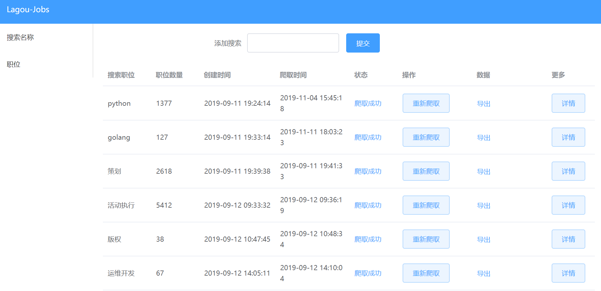
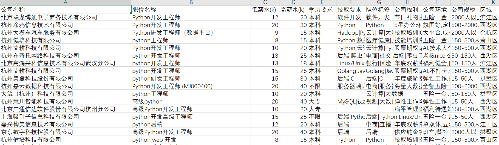

# Django-Celery

用Django和Celery爬取和展示拉勾上的职位信息

[详细介绍](http://www.zchengjoey.com/posts/celery+django%E8%87%AA%E5%8A%A8%E7%88%AC%E5%8F%96%E5%B1%95%E7%A4%BA%E6%8B%89%E5%8B%BE%E8%81%8C%E4%BD%8D/)


## Installation

download the project to /opt/

```bash
pip3 install requirements.txt
python3 manage.py runserver 0.0.0.0:3389
```
celery:
```
celery worker -A mysite -l info
celery beat -A mysite -l info
```

or use docker-compose:
```
cd /opt/django_celery && docker-compose up -d
```

## Usage
open browser http://127.0.0.1:3389/






## Contributing
joeycheng

## License
[DEMO](http://101.91.120.168:3389/)